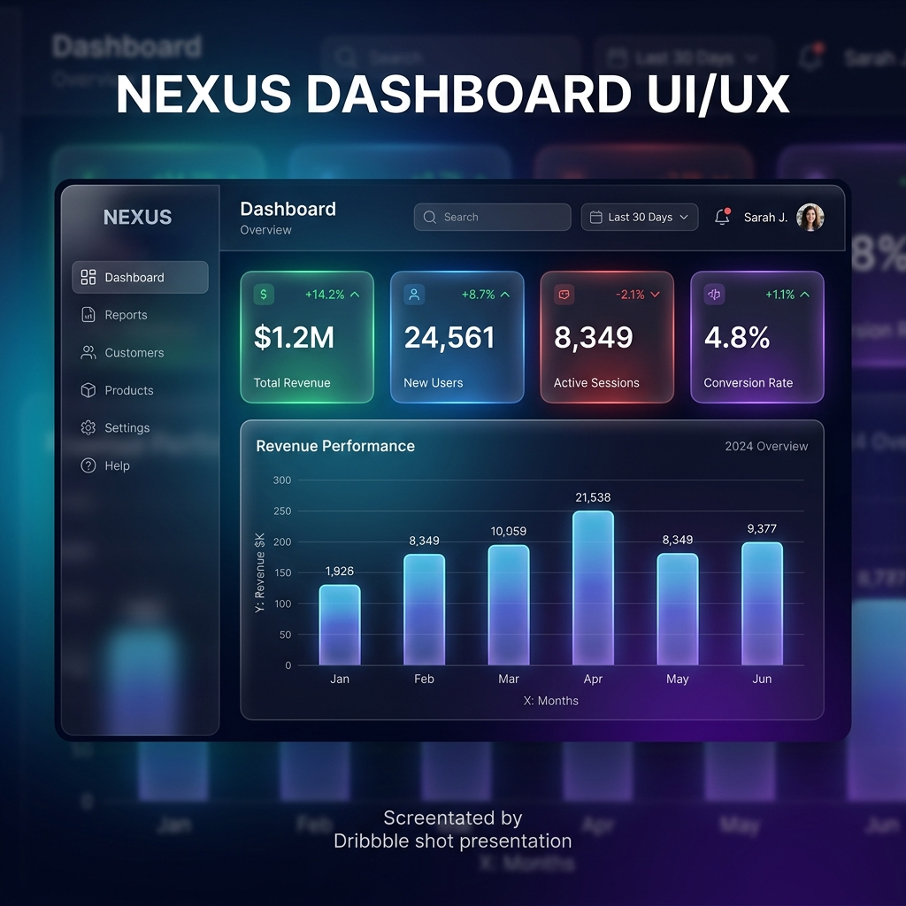

# GlassDashboardLayout

A complete dashboard and analytics layout utilizing glassmorphism aesthetics. It includes a responsive sidebar navigation, a top search bar, KPI metric cards, a CSS-based mock chart, and an activity feed.

## Preview

## Usage

Copy \`GlassDashboardLayout.jsx\` to your project. It requires Tailwind CSS and \`lucide-react\` for icons.

\`\`\`jsx
import GlassDashboardLayout from './GlassDashboardLayout';

export default function App() {
  return (
    

      <GlassDashboardLayout />
    

  );
}
\`\`\`
