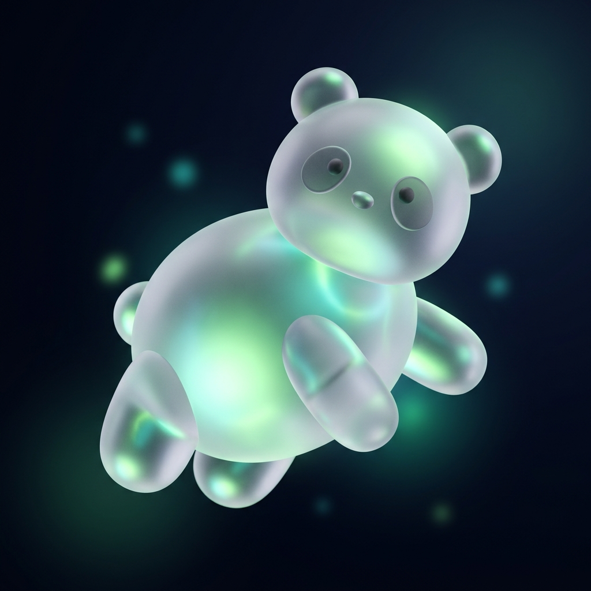

# GlassMascotAvatar

A beautiful, animated glassmorphism avatar container designed perfectly for displaying 3D mascot logos. It features a continuous floating animation and an ambient glowing backdrop that you can color-match to your mascot.

## Preview

## Usage

This component relies on \`framer-motion\` for the subtle floating animations.

\`\`\`jsx
import GlassMascotAvatar from './GlassMascotAvatar';

export default function App() {
  return (
    

      <GlassMascotAvatar 
        src="/glass_mascot_fox.jpg" 
        glowColor="rgba(168, 85, 247, 0.4)" 
        size={150} 
      />
      <GlassMascotAvatar 
        src="/glass_mascot_panda.jpg" 
        glowColor="rgba(16, 185, 129, 0.4)" 
        size={150} 
      />
    

  );
}
\`\`\`
